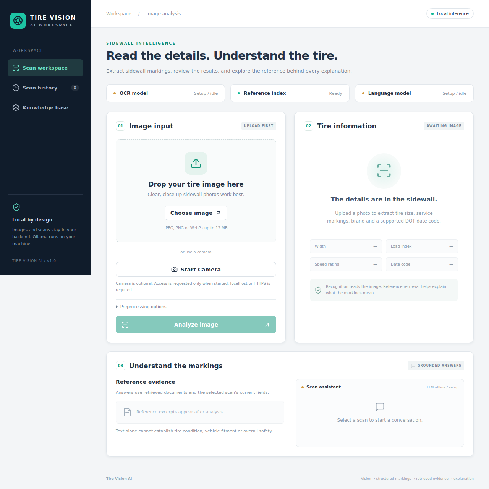
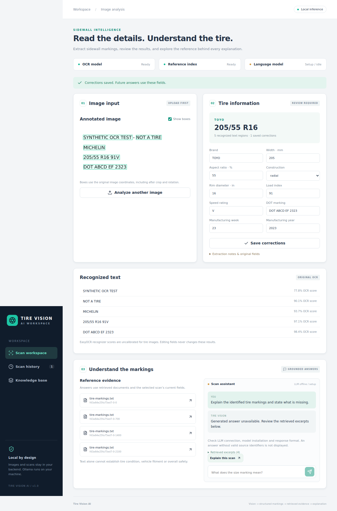
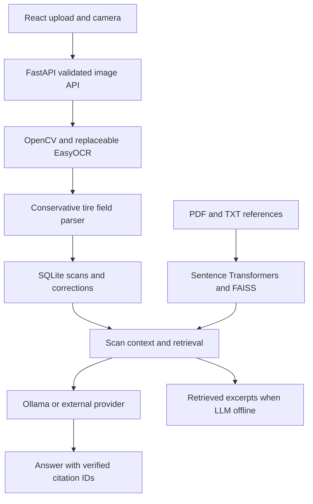

# Tire Vision AI

A local application for reading tire sidewall characters and explaining recognized markings using retrieved reference documents. React sends images to FastAPI; EasyOCR reads pixels; a conservative parser extracts fields; Sentence Transformers and FAISS retrieve evidence; Ollama explains that evidence. Original OCR remains available after user corrections.





[Mobile screenshot](docs/scan-mobile.png) · The scan uses a synthetic OCR target, not a tire performance benchmark.

## Implemented capabilities

- Image upload, drag and drop, preview, optional browser camera capture and camera selection.
- Real pretrained English OCR, original-image polygon overlays, recognizer scores, contrast enhancement, quarter-turn rotation and pixel-coordinate cropping.
- Tire size, service description, known brand and context-supported modern DOT date parsing. Unidentified values are null.
- SQLite scan history, pagination, persistent user corrections, scan-specific conversations and cascading deletion.
- TXT and text-PDF ingestion, overlapping chunks, semantic embeddings, FAISS cosine search and source excerpts with filenames, pages and stable chunk identifiers.
- Default local Ollama provider, optional OpenAI-compatible API, connection/model health checks and retrieval-only behavior when generation is unavailable.
- Desktop/mobile UI, validated API schemas, explicit CORS, upload signature/dimension limits, Docker Compose and isolated GitHub Actions checks.

The project does not claim production readiness or measured real-tire accuracy. Text recognition does not assess tire condition, roadworthiness or overall safety.

## Architecture



Backend modules: `api.py`, `vision.py`, `parsing.py`, `retrieval.py`, `generation.py`, `storage.py`, `schemas.py`, `config.py`. The `VisionModel` protocol allows a custom detector/recognizer to return `Detection` objects without changing retrieval. CPU is the default. SQLite persists chunk text and metadata; the in-memory FAISS index rebuilds from those records after restart using the configured embedding model. Models load on demand; weights are explicitly downloaded separately.

## Local setup

Requirements: Python 3.12, Node 22+, sufficient disk for PyTorch/models and internet during installation. Start with 16 GB RAM for the application plus a 4B local LLM; CPU inference is supported but can be slow. This is a starting hardware assumption, not a performance measurement. A 1.7B model uses less memory. GPU acceleration requires compatible drivers/PyTorch and `OCR_GPU=true`; the default Docker image uses CPU PyTorch.

From the repository root on Linux/macOS:

```bash
python3.12 -m venv .venv
source .venv/bin/activate
python -m pip install --upgrade pip
pip install torch==2.6.0 torchvision==0.21.0 --index-url https://download.pytorch.org/whl/cpu
pip install -r backend/requirements.txt
cp .env.example .env
python scripts/download_models.py
python -m uvicorn app.main:app --app-dir backend --host 127.0.0.1 --port 8000 --no-access-log
```

In a second terminal:

```bash
cd frontend
npm ci
npm run dev -- --host 127.0.0.1 --port 5173
```

Open **http://localhost:5173**. OpenAPI and interactive API examples: **http://localhost:8000/docs**. On Windows use `py -3.12 -m venv .venv`, `.venv\Scripts\Activate.ps1` and `Copy-Item .env.example .env`; the other Python/npm commands are the same. Run commands from the repository root unless instructed otherwise.

Image upload does not require a camera or LLM. Missing OCR dependencies/weights return HTTP 503; detections are never fabricated. Missing embedding weights produce a visible retrieval setup warning while OCR and scan storage continue. Model downloads are disabled during routine startup/inference. If you change the embedding model, install its weights and restart to rebuild the index.

## Ollama setup (no API key)

Install Ollama for your OS from [ollama.com/download](https://ollama.com/download). Follow the [official quickstart](https://docs.ollama.com/quickstart). On Linux the official installer is:

```bash
curl -fsSL https://ollama.com/install.sh | sh
ollama serve
```

If the installer/app already started the service, do not start a second server. In another terminal:

```bash
ollama pull qwen3:4b
ollama run qwen3:4b
```

For a smaller model:

```bash
ollama pull qwen3:1.7b
```

Set `OLLAMA_MODEL=qwen3:1.7b` in `.env` and restart the backend. The default is `OLLAMA_BASE_URL=http://localhost:11434`, `OLLAMA_MODEL=qwen3:4b`, `LLM_TIMEOUT=90`. The provider uses non-streaming structured output and disables thinking for this model. Health checks `/api/tags` and checks that the configured model is installed. Connection and request timeouts return an explicit generation-unavailable result with the actual retrieved excerpts; generation is never replaced with a fabricated answer.

## Docker

```bash
cp .env.example .env
docker compose build
docker compose up -d
docker compose exec backend python scripts/download_models.py
docker compose exec ollama ollama pull qwen3:4b
docker compose restart backend
```

Open **http://localhost:8080**. Persistent volumes hold uploads/database, OCR/embedding weights and Ollama models. The backend reaches Ollama at `http://ollama:11434`. Published ports are bound to loopback. If you prefer host-installed Ollama, override `OLLAMA_BASE_URL` in Compose to `http://host.docker.internal:11434`, remove the bundled Ollama dependency and add `extra_hosts: ["host.docker.internal:host-gateway"]` on Linux. Host Ollama must listen on an interface reachable from Docker; restrict network access appropriately. `docker compose down` keeps volumes; do not use `-v` if you want to retain scans.

## Optional external LLM

Set the following only on the backend:

```dotenv
LLM_PROVIDER=external
EXTERNAL_BASE_URL=https://your-provider.example/v1
EXTERNAL_MODEL=your-model-name
EXTERNAL_API_KEY=your-own-key
```

The provider must support `/chat/completions` and JSON object response format. Its health probe uses `/models`; providers without that endpoint can still generate but will show unavailable health. Choosing this option sends current fields, retrieved excerpts and recent scan conversation to that provider. Images are not sent to the LLM. No credentials appear in frontend code; `.env` is ignored. No key is included or required for Ollama.

## Upload and camera

Upload a JPEG, PNG or WebP up to 12 MB and 20 million decoded pixels (configurable server limits). Each side must be at least 32px. MIME type and signature must agree; animations and unsupported types are rejected. Server images are re-encoded to PNG, stripping source metadata. Pixel orientation is preserved rather than silently applying EXIF rotation; use the rotation setting when needed.

Crop accepts `[x, y, width, height]` in original image pixels. OCR operates on the crop after a clockwise quarter-turn; the inverse transform maps every polygon to the original displayed image. The viewer's SVG and image share the same dimensions.

Camera is optional and permission is requested only when **Start Camera** is pressed. **Capture** creates a PNG; **Retake** restarts the camera; **Stop Camera** and component teardown stop tracks. Choose another camera after stopping the current one. Permission denial leaves upload functional. Browser camera access requires **localhost or HTTPS**. Hardware capture remains unverified unless documented otherwise in the validation report.

## API examples

```bash
curl http://localhost:8000/health
curl -F 'file=@/path/to/tire.png;type=image/png' -F 'rotation=0' -F 'contrast=true' http://localhost:8000/api/scans
curl 'http://localhost:8000/api/scans?page=1&page_size=12'
curl http://localhost:8000/api/scans/SCAN_ID
curl -X PATCH http://localhost:8000/api/scans/SCAN_ID -H 'Content-Type: application/json' -d '{"brand":"MICHELIN","width_mm":205,"aspect_ratio":55,"construction":"radial","rim_inches":16,"load_index":91,"speed_rating":"V"}'
curl -X POST http://localhost:8000/api/scans/SCAN_ID/chat -H 'Content-Type: application/json' -d '{"question":"Explain the size marking and missing fields."}'
curl -F 'file=@/path/to/reference.txt;type=text/plain' http://localhost:8000/api/documents
curl -X DELETE http://localhost:8000/api/scans/SCAN_ID
```

`PATCH` replaces the complete corrected field set; omitted fields become null. Original OCR and original parsed fields remain unchanged. Manufacturing week/year must be supplied together. API responses distinguish parsing warnings from recognizer scores. Scan IDs are opaque UUIDs. Status codes: 201 created, 204 deleted, 404 missing scan, 413 oversized upload, 422 invalid content/schema, 503 missing model setup. Image delivery uses `/api/scans/{scan_id}/image` with no-store caching.

The UI builds `FormData` containing the selected file, rotation, contrast and optional crop. FastAPI validates the bytes, decodes/preprocesses the image, runs actual EasyOCR, maps polygons, parses text, retrieves reference chunks and persists the scan. The UI displays the returned image/fields; chat separately combines the selected scan’s current fields with freshly retrieved evidence.

## OCR and parser limitations

[EasyOCR](https://github.com/JaidedAI/EasyOCR) uses a pretrained CRAFT detector and English generation-2 recognizer (downloaded `craft_mlt_25k.pth` and `english_g2.pth`). It is general scene-text OCR, not trained specifically for tire sidewalls. Curvature, embossing, glare, low contrast, tiny markings and occlusion can produce missed text and errors. CLAHE and rotation help some images but do not unwrap curved text. Recognition scores are model output, uncalibrated on tire images, and are not probabilities of parsing correctness.

The parser accepts a constrained passenger-style size pattern and a known-brand vocabulary; it does not support every commercial/motorcycle marking, ZR size syntax or complete dual-load service descriptions. Multiple competing size strings/brands require manual correction. A DOT date is accepted only for one DOT line with a terminal, separated four-digit code, week 01–53, and a non-future week/year. Split DOT/date lines are deliberately not joined. A terminal code is a contextual candidate, not independent proof of manufacture. It does not interpret pre-2000 three-digit dates or infer unknown fields.

## References and citation behavior

Bundled notes are **project-authored**, with external reading links recorded in `references/ATTRIBUTION.md`; no copyrighted rating table or photograph is copied. PDF/TXT uploads preserve document filenames, PDF page numbers and SHA256-derived chunk IDs. Text chunks are 900 characters with a 200-character overlap. Normalized all-MiniLM-L6-v2 embeddings feed a FAISS inner-product index; results below configured cosine similarity are excluded. Scores indicate retrieval similarity, not factual reliability.

Generation receives only retrieved excerpts, current fields and recent scan-specific conversation since the last correction. Original OCR is preserved in the API; corrected fields drive subsequent answers. Saving corrections starts a fresh generation context; older conversation remains visible for audit but is excluded from subsequent prompts. Reference content is explicitly untrusted data. The backend rejects answers with missing, mismatched or unknown citation identifiers. Valid IDs demonstrate traceable evidence, **not a guarantee that every generated claim is supported**; review excerpts. No evidence means an explicit insufficient-evidence response. Scanned PDFs without a text layer are unsupported.

Reference ingestion is global to this single-user local installation; chat/scan data is isolated by scan. This application has no accounts/authentication, upload antivirus, rate limiting or multi-tenant controls. Keep it local; add authentication and appropriate operational controls before remote/shared use.

## Tests and validation

```bash
source .venv/bin/activate
pip install -r backend/requirements-test.txt
pytest backend/tests -q
cd frontend
npm ci
npm run check
npm run build
```

Routine CI injects clearly identified OCR/embedding/provider test doubles and uses real SQLite, PDF extraction, image decoding and FAISS. It needs no model downloads, private credentials, camera or Ollama. The release integration commands use real models:

```bash
# Repository root, activated .venv; install/download models first
python scripts/make_smoke_image.py
python scripts/integration_check.py
cd frontend
npx playwright install chromium
npm run test:e2e -- --workers=1
```

Playwright starts real backend/frontend services. `PYTHON_BIN` can override the backend Python executable. Its upload workflow uses actual OCR and records actual application screenshots. The synthetic target is marked **NOT A TIRE**; it checks plumbing, not real-world accuracy. Camera-denial handling is simulated and does not validate physical capture. See [validation results](docs/VALIDATION.md) for checks actually performed.

## Troubleshooting

- **OCR setup error:** activate the correct Python environment, install requirements, run `scripts/download_models.py` from the repository root and check `OCR_MODEL_DIR`.
- **Missing reference index:** download the embedding model, restart to seed bundled notes; ingestion requires extractable PDF/TXT text.
- **Ollama offline or model missing:** run `ollama serve` if needed and `ollama pull` for the exact configured model. In Compose use the container commands above.
- **Generation unavailable despite connection:** check JSON support, model name and timeout. Responses with invalid citation IDs are withheld.
- **Docker host connection fails:** use the service name for container Ollama or configure host gateway/listen address for host Ollama.
- **Image upside down / boxes:** set a quarter-turn before analysis. Boxes remain anchored to the original pixel image.
- **Poor recognition:** use a sharp, close, evenly lit photo and try contrast/cropping. Correct fields manually. No tire accuracy benchmark is claimed.
- **Frontend API fails:** run backend on port 8000; Vite proxies API requests. Explicit CORS allows localhost 5173/8080 by default.

## Future work

A permissioned real-tire evaluation set, curved-text rectification, tire-specific OCR fine-tuning, better multi-line DOT association, reviewed manufacturer rating tables, document management, persistent vector snapshots, authentication, retrieval evaluation and claim-level evidence checks.
